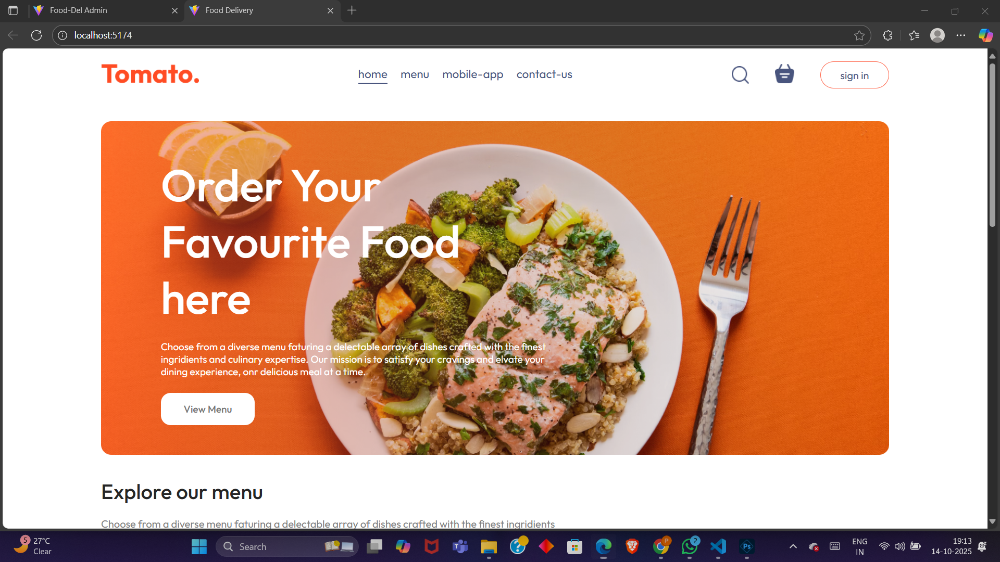
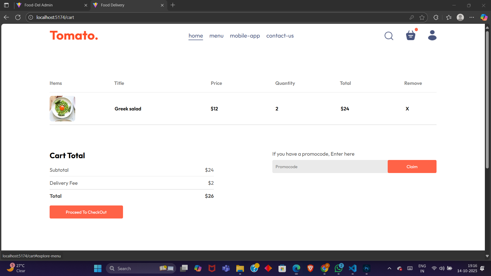
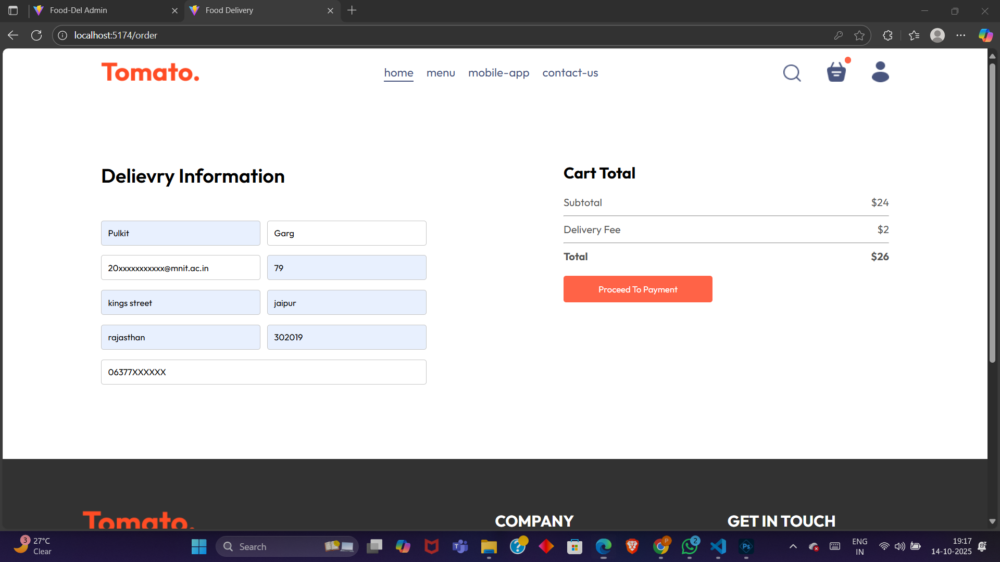
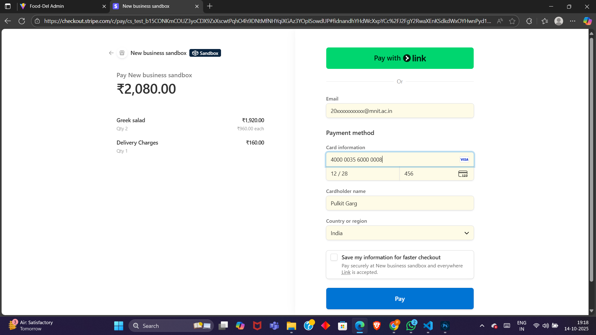
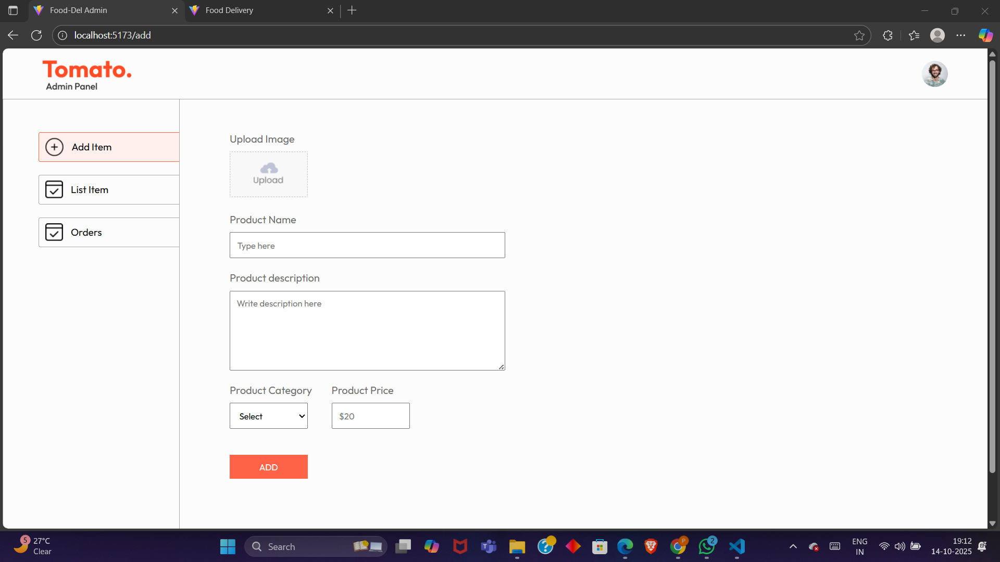
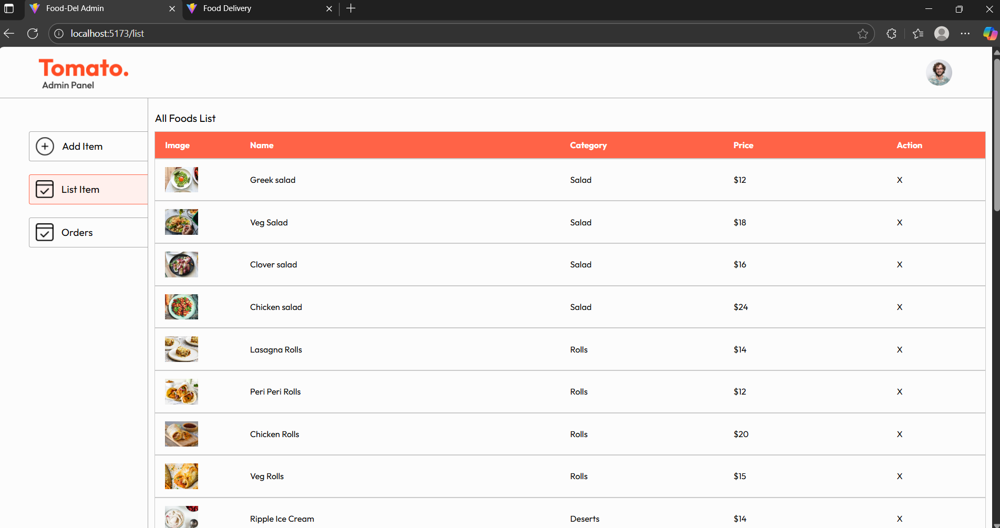
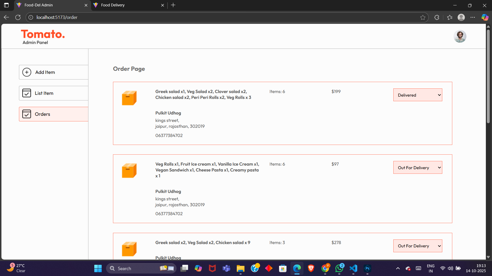

# Food-Delievery-App


A complete **Food Delivery Web Application** built using **MERN stack (MongoDB, Express.js, React.js, Node.js)** with seprate **Client**, **Admin**, and **Server** modules.
This app allows user to browse food items, add to Cart, make online payments(Stripe) , check  order history and live order status and amins can manage orders , menu and users.


# Features 

## Client (User Side)
- User Authentication (JWT-Based Login & SignUp)
- Food browsing and search
- Add to cart & order placement
- Online payment via **Stripe**
- Order history and live order status
- UI & UX responsive

## Admin Panel
- secure admin login
- Manage food items (add/update/delete)
- Manage orders and track user payments
- UI & UX responsive 

## Server (Backend)
- RESTful APIs builtusing express.js
- MongoDB Atlas for data storage
- secure authentication using JWT
- Stripe payment integration
- MVC folder structure


# Tech Stack 
**Frontend**: React.js, Axios, CSS
**Backend**: Node.js , Express.js
**DataBase**: MongoDB(Atlas)
**Payments**: Stripe API
**Authentication**: JWT(Json Web Token)

# Setup Instructions 

## Clone the repository 
```bash
  git clone https://github.com/Pulkit6377/Food-Delievery-App.git
  cd Food-Delivery-app
```
## Install Dependencies

### Server Setup
```bash
  cd server
  npm install
  npm start
```

### Client Setup
```bash
  cd ../client
  npm install
  npm run dev
```

### Admin Setup 
```bash
  cd ../admin
  npm install
  npm run dev
```

## Enviroment Variables 
Create a .env file inside the server folder and add 

JWT_SECRET=your_secret_key
STRIPE_SECRET_KEY = your_secret_key

## Test payment (Stripe)

Card Number: 4000 0035 6000 0008
Expiry: Any future date
CVV: 123

# Folder Structure 

food-delivery-app/
│
├── client/   → React frontend for users
│     ├── src/
│          ├── components/
│          ├── pages/
|          ├── context/
|          ├── assets/
|          ├── main.js
│          └── App.js
│
├── admin/    → React admin dashboard
│     ├── src/
│         ├── components/
│         ├── pages/
|         ├── assets/
|         ├── main.js
│         └── App.js
│
├── server/   → Express.js backend
│   ├── models/
│   ├── routes/
│   ├── controllers/
|   ├── config/
|   ├── middleware/
|   ├── uploads/
│   ├── server.js
│   └── .env
│
└── README.md

# ScreenShots

## User

### Home Page

### Cart page

### CheckOut Page

### Payment Page

### My Orders Page


## Admin

### Ulpoad Page

### List Page

### Orders Page



# Contributing 

Contributions, issues, and feature requests are welcome!
Feel free to fork this repo and submit a pull request.


